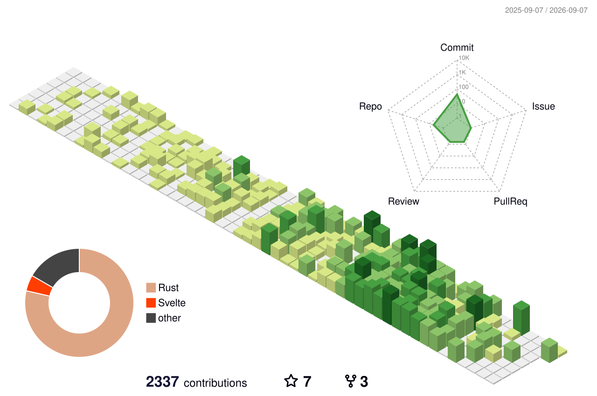

  
  
  

  
  
  
  
  
  
  
  
  
  
  

## 👋 About

I build production software end to end: Rust backends, TypeScript / Svelte frontends, Flutter mobile clients, and the infrastructure around them. My degree is in AI application, and my day job is building LLM agents for finance workflows. On the side I run **[ACGHub](https://acghub.net)**, a community platform I have designed, written and operated alone since 2024.

Most of my code lives in private repositories, so the projects below come with their scale instead of a link. Judge the numbers.

## 🚀 Selected work

| Project | Stack | Status | What it is |
|---|---|:---:|---|
| **ACGHub**   [acghub.net](https://acghub.net) |     |  | Tag-driven community platform for anime, comics and games. **~215k lines Rust, ~230k lines TypeScript, 1,600+ commits** across the two main repos. Backend, web, mobile app, admin console, static CDN, status page and short-link service, all one person. |
| **ACGHub API Guard** |   |  | Browser-to-server request integrity layer: ECDH session keys, HMAC canonical requests, nonce + timestamp windows, proof-of-work handshake, multi-dimension rate limiting. Turns "one `curl` line" into "days of reverse engineering". |
| **Luna-Pass** |   |  | Unified auth and SSO across all ACGHub subdomains: local accounts, OAuth (GitHub / Google), opaque-token sessions, RBAC with role inheritance. |
| **ACGHub Studio** |   |  | Script-to-storyboard (ネーム) workbench for comic authors: prose script in, editable paged panels out. Two-page spread canvas with RTL reading order, a pacing strip that plots panel density and page-turn hooks, and procedural composition sketches from shot type, camera and cast. Frontend MVP; Rust backend next. |
| **Qingjian 青简**   [repo](https://github.com/qingjian-team/qingjian) · [qingjian.app](https://qingjian.app) |  |  | Cross-platform pinyin input method that shows a translation next to each candidate in the language you are learning. Learn a word every time you type, without opening a learning app. |
| **Guixu 归墟** |   |  | Framework for long-running multi-agent systems: agents as persistent participants, event-driven and periodic scheduling, generated content feeding back into system state. |
| **Bling Atelier** |   |  | AI product-image generation fused with a lightweight ERP (SPU / SKU, assets, render history, inventory) for apparel sellers. |
| **Bank receipt RPA** |   |  | Automated download and archival of bank receipts from multiple Chinese banks, with task queue, dashboard and object-storage upload. Built for finance operations at work. |

## 📦 Open source

| Repo | What |
|---|---|
| [qingjian-team/qingjian](https://github.com/qingjian-team/qingjian) | Rust input method engine described above |
| [my-axum-starter](https://github.com/yenharvey/my-axum-starter) | Axum project template with the conventions I use in production |
| [qq-bot-rs](https://github.com/yenharvey/qq-bot-rs) | QQ bot SDK in Rust |
| [tencent-sdk-unofficial](https://github.com/yenharvey/tencent-sdk-unofficial) | Typed Rust client for Tencent Cloud APIs |
| [aliyun-dypns](https://github.com/yenharvey/aliyun-dypns) | Rust SDK for Aliyun SMS verification |
| [tieba-sign](https://github.com/yenharvey/tieba-sign) | Baidu Tieba check-in CLI |
| [mygo-studio/anon-flatten](https://github.com/mygo-studio/anon-flatten) | Directory flattening tool |
| [yahboom_gps](https://github.com/yenharvey/yahboom_gps) | Serial GPS driver for a Yahboom module |

## 🛠 Skills

- **Rust** — primary language. Axum, Tokio, SeaORM, WASM, CLI tooling, SDK design. Comfortable owning a 200k-line codebase alone.
- **AI applications** — LLM agents, tool use, multi-agent orchestration, RAG. Finance agents in production at work.
- **Web** — TypeScript, SvelteKit, Next.js, Cloudflare Workers. Flutter for mobile.
- **Python** — automation, RPA, data pipelines, Manim.
- **Infrastructure** — PostgreSQL, Docker, GitHub Actions, CDN and edge deployment, Tencent Cloud and Aliyun.
- **Learning** — C# and .NET, for Unity DOTS and device-side control.

## 🧭 Now

- Running and growing ACGHub; getting Studio from mock data to a Rust backend.
- Moving toward embodied AI: vision-only navigation (VSLAM / monocular depth) on a mobile service robot, LLM planner over a skill library.
- Prototyping a small-scale real-time tactics game in Unity DOTS.

## 📈 Activity

<!-- 设置 METRICS_TOKEN secret 并重跑 Metrics workflow 后，取消下面这段注释
Languages across all repositories I own or contribute to, private and organization repos included:

-->

<picture>
  <source media="(prefers-color-scheme: dark)" srcset="./profile-3d-contrib/profile-night-rainbow.svg" />
  
</picture>
