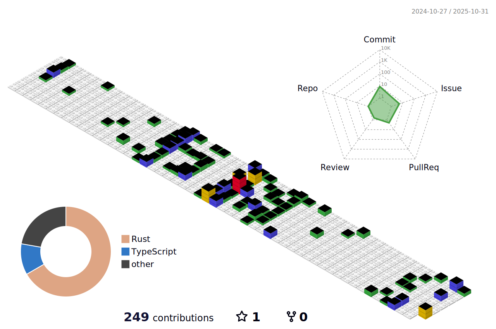

### Hi there 👋

<!--  -->
<!--
**YenHarvey/YenHarvey** is a ✨ _special_ ✨ repository because its `README.md` (this file) appears on your GitHub profile.

Here are some ideas to get you started:

- 🔭 I’m currently working on ...
- 🌱 I’m currently learning ...
- 👯 I’m looking to collaborate on ...
- 🤔 I’m looking for help with ...
- 💬 Ask me about ...
- 📫 How to reach me: ...
- 😄 Pronouns: ...
- ⚡ Fun fact: ...
-->

## My GitHub Stats

## Programming Languages

## My GitHub Trophies

## My GitHub Streak

## My GitHub Activity

## My Github Contributions

<!-- <picture>
  <source media="(prefers-color-scheme: dark)" srcset="github-snake-dark.svg" />
  <source media="(prefers-color-scheme: light)" srcset="github-snake.svg" />
  
</picture> -->

<!--  -->

## ALL

<!-- 花式分割线 -->
<!-- ---

 -->
